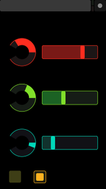
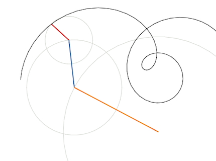

# Livex

A Phoenix + Elm visual playground for [`Phoenix.OSC`](//github.com/zampino/phoenix_osc)
and [TouchOSC](//hexler.net/software/touchosc). Elm code is in `web/elm`.

## Setup

Open `demo.touchosc` with [TouchOSC layout editor](http://hexler.net/docs/touchosc-editor) and upload it to your phone.

Run Phoenix with `mix phoenix.server` and point your TouchOSC app to your
machine's ip setting UDP port to `8000` (or the configured one).
